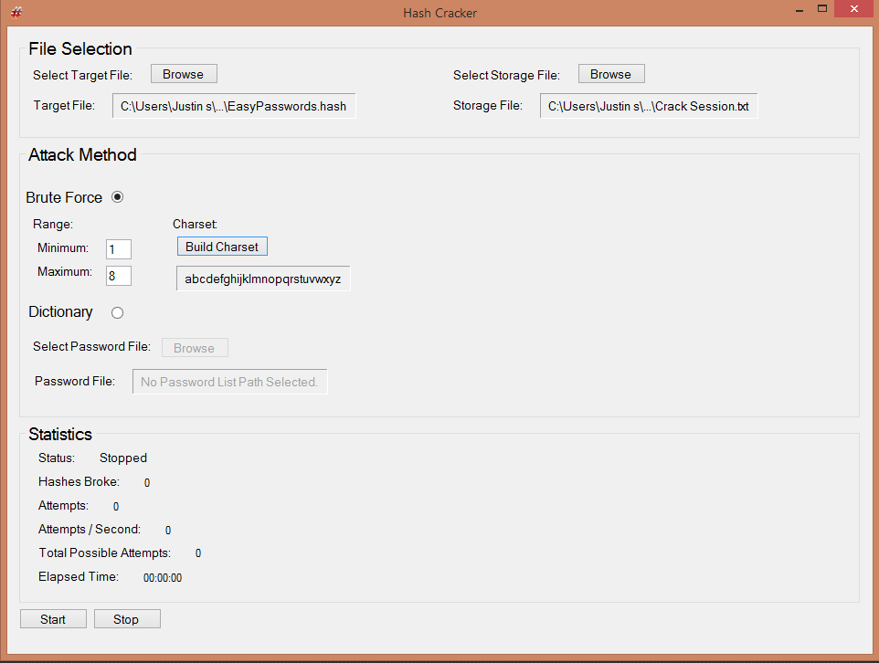
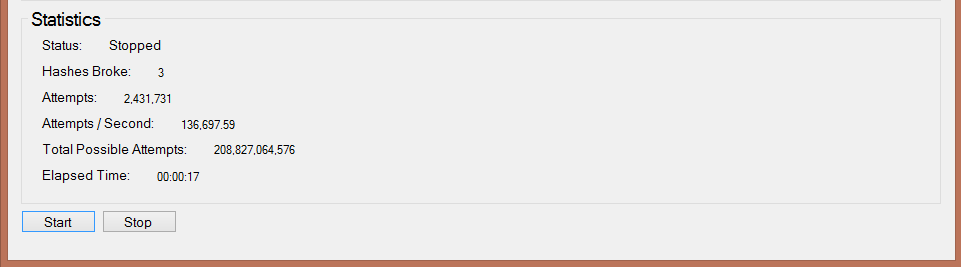

# Hash Cracker

Hash Cracker allows you quickly load in a .hash formated file and start cracking.

Supported Cracking Methods: Brute Force, Dictionary

Hash Cracker implements a clean and simplistic interface to guide you through the cracking process.
This interface also allows you to view minimalistic stats while waiting for the given hashes to be cracked.

Steps:
1. Select target .hash file and session storage location.
2. Select attack method along with that method's distinct options.
3. Go

